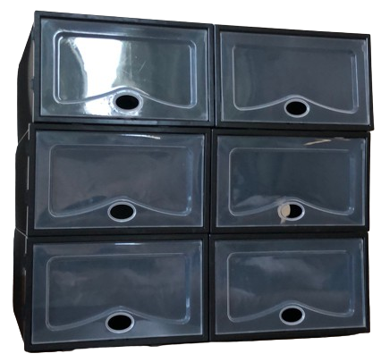
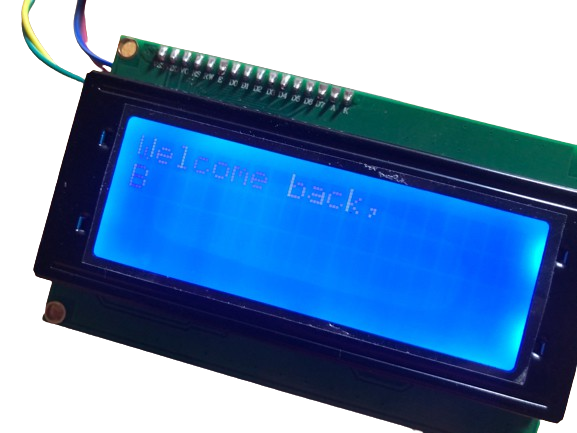
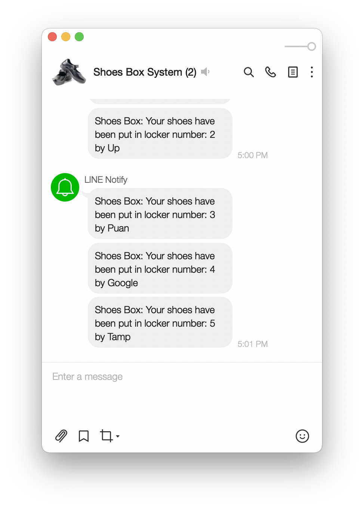

# RFID Shoes Box
This project was originally developed in December 2020 as a school project at *The Prince Royal's College, Chiang Mai, Thailand*. The system uses RFID technology to create an automated shoe storage and tracking solution.

> [!IMPORTANT]
> - This code base is from 2020 and may require updates for current library versions
> - LINE Notify service used in this project is being discontinued
> - API keys and credentials in code samples are non-functional examples
> - If implementing a similar system today, consider modern alternatives for notifications

## Features
- Secure shoe storage with RFID authentication
- Real-time locker status tracking
- Automated locker assignment system
- LINE notifications for all locker activities
- LED indicators for occupied lockers
- Anti-theft protection system
- Unauthorized access detection

## Hardware Components
- Arduino UNO (Locker control + RFID)
- ESP8266 NodeMCU (WiFi + Cloud connectivity)
- RC522 RFID reader
- I2C LCD Display
- LED indicators for each locker
- Passive buzzer
- Power supply unit

## Software Architecture
1. **Arduino (`SHOESBOX010.ino`)**
   - RFID card reading
   - Locker management
   - LED control
   - LCD display
   - Serial communication with ESP8266

2. **ESP8266 (`ESP8266.ino`)**
   - WiFi connectivity
   - LINE notifications
   - Status monitoring
   - Security alerts

## Data Flow
1. Student presents RFID card
2. System authenticates student ID
3. Available locker assigned/opened
4. LED indicator activated
5. LINE notification sent
6. Status updated on LCD

## Screenshots

   LCD Display Interface
   

   LINE Notification System
   

   How to use the system (Thai)
   

## Setup Requirements
1. Arduino IDE
2. Required Libraries:
   - MFRC522
   - ESP8266WiFi
   - TridentTD_LineNotify
   - LiquidCrystal_I2C
   - SoftwareSerial

## Historical Context
This system was developed to address shoe security concerns in Thai schools where students traditionally remove shoes before entering buildings. While some services (like LINE Notify) are being discontinued, the core functionality remains relevant for automated locker systems.

## License
This project is shared for educational purposes. Feel free to modify and improve upon it while maintaining appropriate attribution.
